# Capstone 2: Custom Food Shop

## <center>🧄*The Ultimate Garlic Shop*🧄
### <center> *===Accepts $ & ₿===*⠀⠀

## Project Overview
- Created a CLI sales application system that implements OOP design.
- Customers can build an order from multiple menu items, apply customization and check summary of their order.
- The application generates a receipt file for every completed order and stores it in ReceiptFolder.
- Application supports both cash and ₿itcoin payment option at checkout.

## Built With
[](https://www.java.com/en/)

## Features
- Customers can choose different menu items such as:
  - Garlic Bread
  - Drinks
  - Sides
  - Dessert
- Customers can also choose between 3 different sizes for Garlic Bread and Drinks (S, M L)
- Customers can customize their Garlic Bread with the choice of either Regular or Premium toppings, and an option to specialize the bread.
- At checkout, customers can choose to make payment either in cash or ₿itcoin

## Usage Display
#### Home Screen:
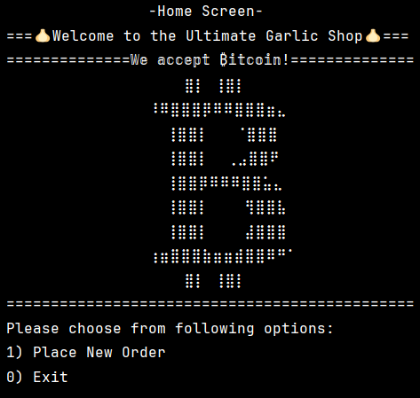


#### Order Screen:

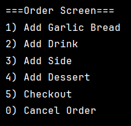

#### Select Bread & Size:
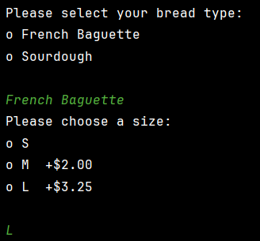

#### Add Topping:
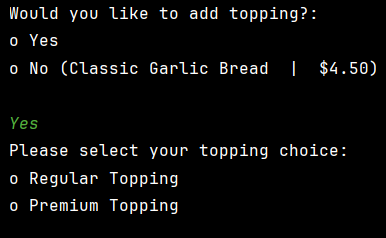

#### Regular Topping:
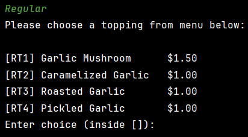

#### Premium Topping:
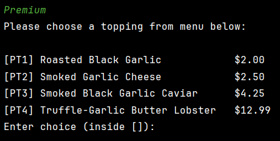

#### Special Option:
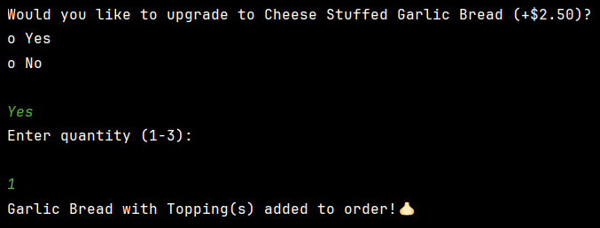

#### Drink Menu:
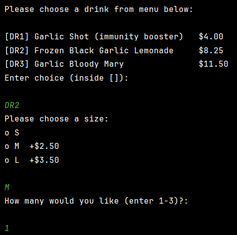

#### Side Menu:
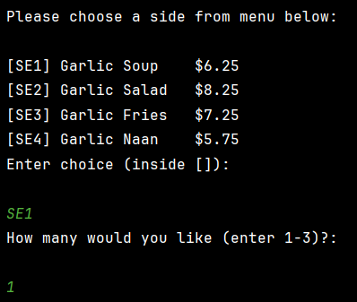

#### Dessert Menu:
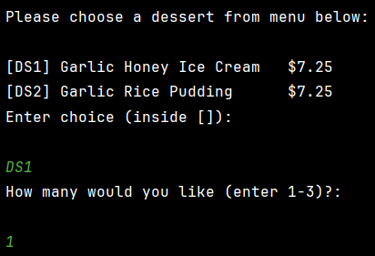

#### Checkout:
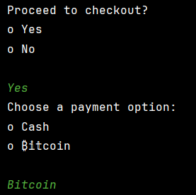

#### Cancel Order:


#### Exit:
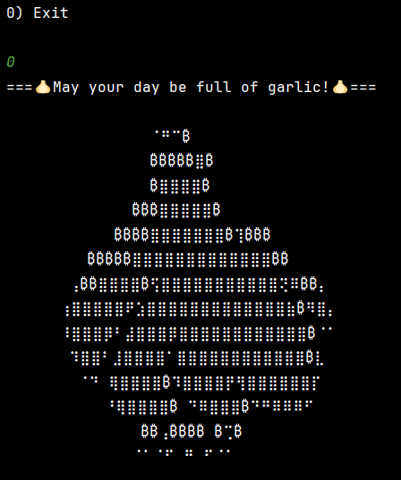

#### Receipt:
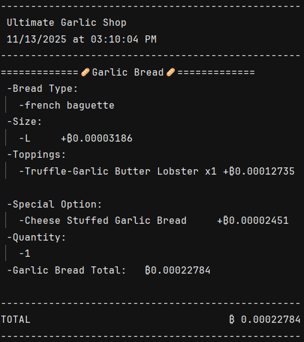

## Interesting Feature (code) Added:
#### Inside Menu Class:
- Each product menu is stored separately in collection using instance of LinkedHashMap(keeps insertion order)
- Each menu item is stored inside the collection with given Key/Value (key: menu code, value: item name, price)
- Getter that returns unmodifiable view of each Map is created that will be called in UI
- The printMenu method formats the menu output and loops through the keys to grab the value and price to print out
```java
public class Menu {
    //setup static HashMap in the field that belongs specifically to the Menu class, NOT part of individual instance
    //data is shared across every Menu object that is used for validating user input when choosing item from menu option

    //region field
    //Regular Topping
    private static final Map<String, String> regularTopping = new LinkedHashMap<>();
    private static final Map<String, Double> regularPrices = new LinkedHashMap<>();
    //...
    //endregion

    //region key/value
    static { //used to initialize static field (LinkedHashMap) when Menu is first referenced; assigns key/value

        //Regular Topping
        regularTopping.put("RT1", "Garlic Mushroom");
        regularPrices.put("RT1", 1.50);
        regularTopping.put("RT2", "Caramelized Garlic");
        regularPrices.put("RT2", 1.00);
        regularTopping.put("RT3", "Roasted Garlic");
        regularPrices.put("RT3", 1.00);
        regularTopping.put("RT4", "Pickled Garlic");
        regularPrices.put("RT4", 1.00);
        //...
    }
    //endregion

    //region getter method
    public static Map<String, String> getRegularTopping() {
        return Collections.unmodifiableMap(regularTopping);
    }
    public static Map<String, Double> getRegularPrices() {
        return Collections.unmodifiableMap(regularPrices);
    }
    //...
    //endregion

    //setting custom printer method for displaying each key/value (similar to toString)
    public void printMenu(Map<String, String> names, Map<String, Double> prices) {
        //sets condition for printing out name and price equally in every line
        int keyLength = 0;
        int nameLength = 0;
        for (String key : names.keySet()) {
            keyLength = Math.max(keyLength, key.length()); //compares previous length to current key length and returns whichever number is bigger
            nameLength = Math.max(nameLength, names.get(key).length());
        }

        nameLength += 2; //adds extra space

        //formatting outside of loop
        String format = "[%-" + keyLength + "s] %-" + nameLength + "s $%.2f%n";

        //print
        for (String key : names.keySet()) { //keySet() returns collection of keys stored in LinkedHashMap
            String value = names.get(key); //looks up the value related to the key
            double price = prices.getOrDefault(key, 0.00); //if it can't find key, returns given default value
            System.out.printf(format, key, value, price); //formatting added after calculation for final print
        }
    }
}
```
#### Inside UserInterface:
- In UI, readUserInput method prompts user until user enters input that matches a key that exists in menu Map and returns when valid key is entered
```java
//helper method to validate user input
    private String readUserInput(Map<String, String> menuChoice){
        String choice;
        while(true){
            System.out.println("Enter choice (inside []): \n");
            choice = scanner.nextLine().toUpperCase();
            if (menuChoice.containsKey(choice)){
                return choice;
            } else {
                System.out.println("Invalid input. Please enter a valid choice inside [].");
            }
        }
    }
```

